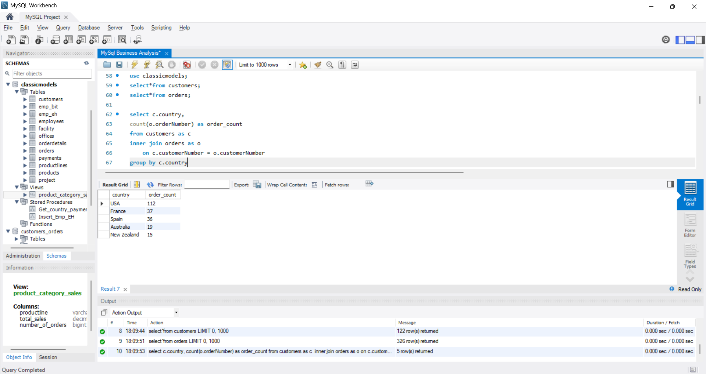
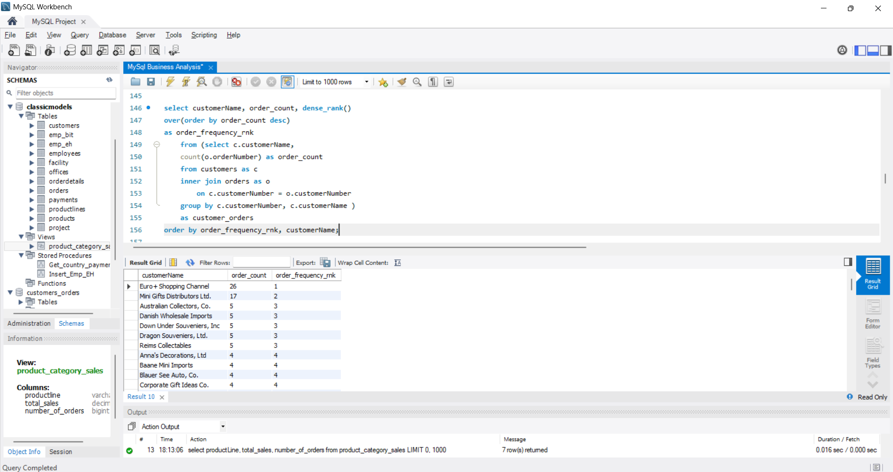
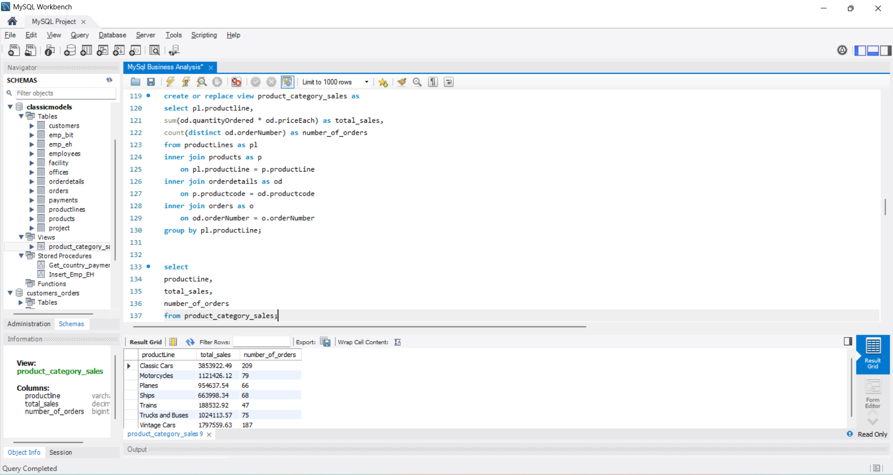

# MySQL Business Analysis

A MySQL-based business analysis project focused on customers, employees, orders, products, payments, and sales performance.

The project demonstrates how SQL can be used to answer business questions, analyze trends, rank customers and products, and build reusable database objects using joins, subqueries, CTEs, window functions, views, stored procedures, and triggers.

## 📌 Project Overview

This project uses the ClassicModels sample database to perform SQL-based business analysis across multiple business areas.

The analysis focuses on:

- Customer behavior and order frequency
- Geographic order distribution
- Product demand and sales performance
- Monthly order and payment trends
- Product category performance
- Employee-manager relationships

In addition to analytical queries, the project demonstrates MySQL database development concepts including constraints, views, stored procedures, triggers, and table modifications.

## 🛠️ Tools & Technologies

- MySQL
- SQL
- MySQL Workbench

## 🎯 Business Questions

This project addresses practical business questions such as:

1. Which countries generate the highest number of orders?
2. How can customers be segmented based on geography?
3. Which customers have the highest order frequency?
4. Which products have the highest quantities ordered?
5. Which product categories generate the highest sales?
6. How does order volume change month over month?
7. Which months have higher payment activity?
8. Which products have a buy price above the overall average?
9. How are employees associated with their respective managers?

## 📊 Business Analysis

### 👥 Customer Analysis

- Customer segmentation based on geographic regions
- Top countries by order volume
- Customer order frequency ranking using `DENSE_RANK()`

### 📦 Product Analysis

- Top 10 products by quantity ordered
- Product categories and sales performance
- Products with buy prices above the overall average

### 📈 Order & Payment Analysis

- Monthly order volume
- Month-over-month order changes
- Monthly payment activity

### 👨‍💼 Employee Analysis

- Employee-manager relationships using a self join

## 🧠 SQL Techniques Demonstrated

### 🔹 Querying & Filtering

- SELECT
- WHERE
- DISTINCT
- LIKE
- ORDER BY
- LIMIT
- CASE

### 🔹 Aggregation & Business Calculations

- COUNT()
- SUM()
- AVG()
- GROUP BY
- HAVING
- Conditional calculations

### 🔹 Data Relationships

- INNER JOIN
- SELF JOIN
- Multi-table joins
- Foreign keys

### 🔹 Advanced SQL

- Subqueries
- Common Table Expressions (CTEs)
- Window functions
- LAG()
- DENSE_RANK()

### 🔹 Database Development

- CREATE DATABASE
- CREATE TABLE
- ALTER TABLE
- Primary keys
- Foreign keys
- UNIQUE constraints
- CHECK constraints
- Views
- Stored procedures
- Triggers
- Functions

## 💡 Key Learning Outcomes

Through this project, I practiced:

- Translating business questions into SQL queries
- Combining data from multiple tables using joins
- Performing aggregation and business calculations
- Ranking customers using window functions
- Analyzing monthly trends using CTEs and LAG()
- Creating reusable SQL views
- Using subqueries for comparative analysis
- Implementing database constraints for data integrity
- Creating triggers for data validation
- Structuring SQL scripts into reusable analytical modules

## 📷 Sample Results

### Top Countries by Order Volume

### Customer Order Frequency Ranking

### Product Category Sales

## 🗂️ Dataset

The analysis uses the ClassicModels sample database, which contains business data related to:

- Customers
- Employees
- Offices
- Products
- Product lines
- Orders
- Order details
- Payments

Additional custom tables were created separately to demonstrate MySQL database development concepts such as constraints, self joins, and triggers.

## 👤 Author

Naveen

Data Analyst | SQL | Excel | Power BI | Tableau
